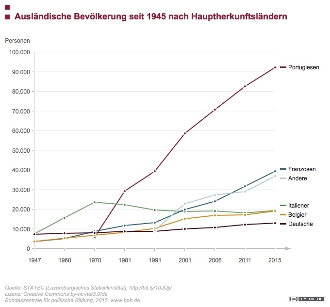

Note: This all is about Luxemburg, since I was not able to find a Diagramm about Germany, that I was able to read

# Immigration to Germany after WWII

In the beginning, the majority of the immigrants to Luxemburg came from either Italy or Germany, and the low ground was held by the Belgian and France.
The Germans stayed relativ leveled, but the Italian had a little headstart, with the Italian immigrating ca. 16.000 people to Luxemburg in only 3 years, from 1947 to 1960.
This growth continues till 1979, with the other countries not able to stand a chance against them, but then suddenly, out of nowhere, Portuguise appear, and took the lead in only 11 years, while the immigration numbers of the Italians slowed down.
