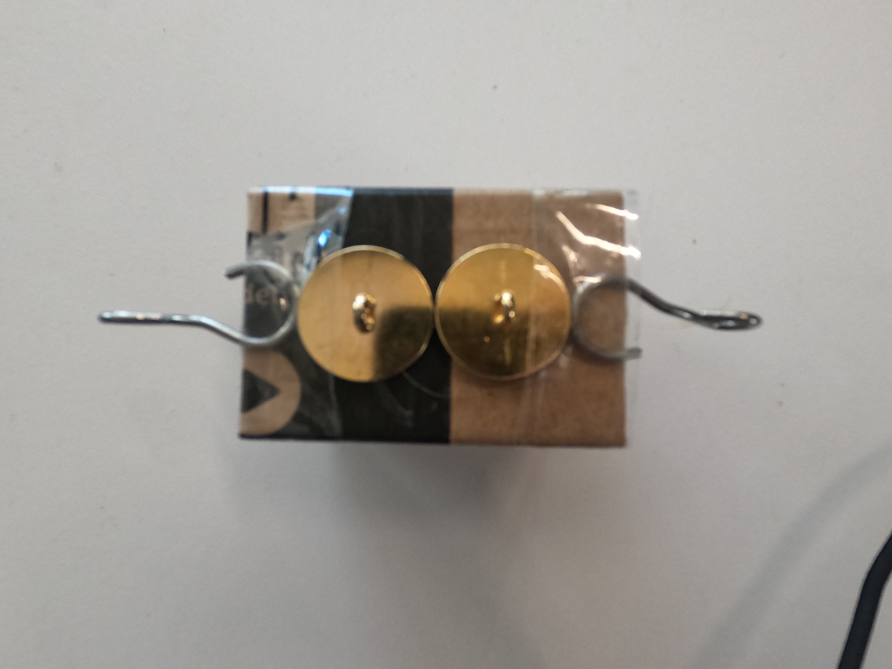

# Die Laufkatze

Unsere Laufkatze besteht aus:

- Pappe
- Tesafilm
- Heißkleber
- 1x Zerschnittener Stift
- 2x Knopf
- 2 Haken

Wir haben zuerst ein Würfelnetz ohne Vor- oder Rückseite auf Pappe gezeichnet, ausgeschnitten und dort den zerschnittenen Stift, ungefähr .5 cm über den Boden, hinein geklebt
An die Unterseite der Laufkatze haben wir die Beiden knöpfe, so dass sich die beiden Schlaufen gegenüberstehen, befestigt.
Wir haben die Haken an die Beiden enden des Bodens mit Tesafilm geklebt.

Das Seil für die Vor und Zurückbewegung der Laufkatze ist mit beiden Enden jeweils an den Haken befestigt.
Das Seil für das anheben des Hakens wird durch den ersten Knopf durchgeführt, und am 2ten Knopf festgebunden, sodass der Haken in der Mitte eingelegt werden kann.

Ich habe keine tests mit meiner Laufkatze durchgeführt, da ich keinerlei Schiebeelement besitze.

###### Copyright (c) 2021 Ben Julius Kirschniak All Rights Reserved.
