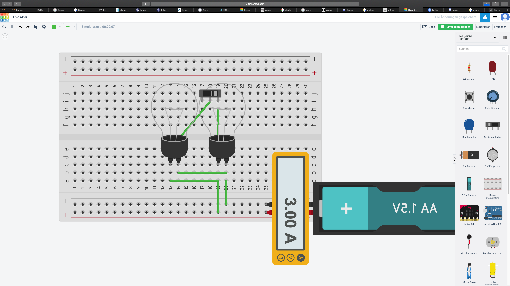

# Einstieg mit TinkerCad

## Nr.1
**b)**

## Nr.2

Ich vermute, dass die Stromstärke bei genau 6amp liegt, da eine normale AA Batterie einen output von Maximal 3.00amp ausgeben kann und wir 2 angeschlossen haben.

Ich kann ihnen nicht genau sagen, welchen Affekt das auf die Laufzeit der Batterie hat, da ich das gesamte internet nach einer Antwort abgesucht habe, ich schätze aber, das beide Batterien mit ihrem Norm laufen und daher eine relativ gute Laufzeit haben
mir ist auch bewusst, das ich vergessen habe das Multimeter wieder auf Stromstärke einzustellen und deshalb nur der gesamte Strom im System angezeigt wird, ich kann ihnen aber versichern das die Stromstärke bei genau 6.00amp lag.

Ich kann ihnen aber genauere details zu den Lampen geben, es Scheint, als das 1 Lampe 0,0225v zieht, und wenn man eine dritte Lampe dazu steckt sinkt die Stromstärke(bei nur einer angeschlossenen Batterie) zu 1,45v so können wir die maximale zahl an Lampen berechnen die wir mit 2 AA Batterien powern können

$$\frac{MaxVolt}{VoltPerTeil} = MaxTeile$$

also 2 \* 1,5 / 0,0225 = 133,3
Wir können also maximal 133 Lampen mit 2 Batterien versorgen

## Nr.4

Ich vermute sehr stark, dass wenn ich den Schalter umlege, nichts passiert, da das einzige was wir machen ein zusätzlicher weg für den Strom ist.

Ich kann ihnen erneut nicht erklären, wie sich die Stromstärke auf die Lebenszeit der Batterie auswirkt, da ich keinerlei Berechnungen zu dem Thema finden konnte.
wenn ich eine dritte Glühbirne dazu stecken würde, dann würde der Stromverbrauch be 0,05v liegen.
